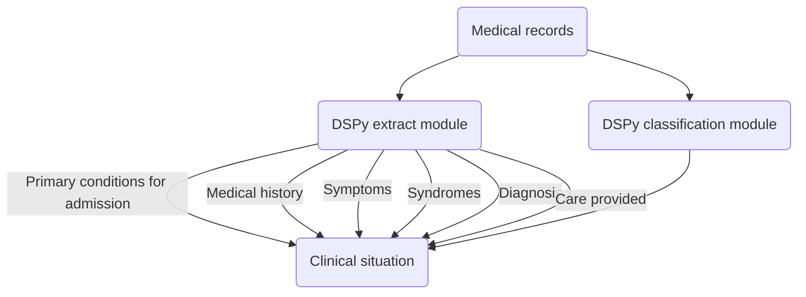

# Clinical situation

Detect clinical situation in medical records using DSPy.

## How it works



## Structure

```
.
├── clinical_situation
│   ├── cli.py
│   ├── config.yaml
│   ├── __init__.py
│   ├── __main__.py
│   ├── modules
│   │   ├── __init__.py
│   │   └── signatures
│   │       └── __init__.py
│   └── utils.py
├── example.txt
├── LICENSE
├── README.md
├── requirements.txt
└── ui.py
```

## Set up

1. Install [Ollama](https://ollama.com/download) and follow instructions.
2. Create a `config.yaml` file in `clinical_situation/` with your settings :

```yaml
llm:
  service: "ollama_chat/"
  port: "http://localhost:11434"
  api_key: ""
```

## CLI

Run it directly :

> *By default, it use the `example.txt` file in the repo.*

```bash
python -m clinical_situation --help 
python -m clinical_situation . mistral
```

Or install it as package :

```bash
pip install -e .
clinical_situation --help
clinical_situation . mistral
```

Output : 

```bash
['Traitement', 0.95]
```

## UI

Run directly :

```bash
streamlit run ui.py
```

And follow the link [http://localhost:8501](http://localhost:8501)