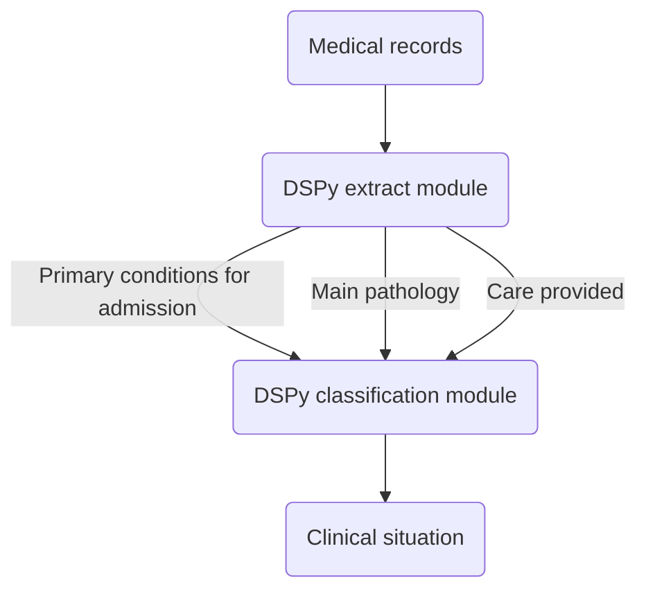

# Clinical situation
Detect clinical situation in medical records using DSPy.

## How it works



## Structure

```
.
├── clinical_situation
│   ├── cli.py
│   ├── config
│   │   ├── config.yaml
│   │   └── __init__.py
│   ├── cs.py
│   ├── __init__.py
│   ├── __main__.py
│   └── modules
│       ├── __init__.py
│       └── signatures
│           └── __init__.py
├── example.txt
├── LICENSE
├── pyproject.toml
└── README.md
```

## Set up

1. Install [Ollama](https://ollama.com/download) and follow instructions.
2. Create a `config.yaml` file in `clinical_situation/config/` with your settings :

```yaml
llm:
  service: "ollama_chat/"
  port: "http://localhost:11434"
  api_key: ""
```

## CLI

Run it directly :

```bash
python -m clinical_situation --help 
```

Or install it as package :

```bash
pip install -e .
clinical_situation --help
clinical_situation . mistral
```

Output :warning: **WORK IN PROGRESS** :warning: : 

```
### Motif d'hospitalisation:
infarctus cutané

### Pathologie principale:
infarctus cutaneus

### Prise en charge:
Local treatment, Topical anti-inflammatory medications, Antihistamines, Analgesics, Balanced diet
  
['Traitement', 1.0]
```