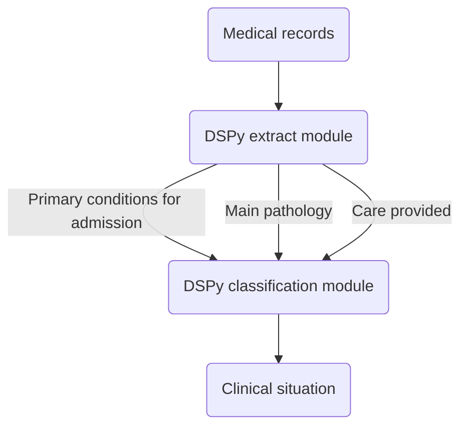

# clinical_situation
Detect clinical situation in medical records using DSPy

# pipeline

```mermaid
flowchart TB

mr("Medical records")
ea("DSPy extract module")
ca("DSPy classification module")
cs("Clinical situation")

mr --> ea
ea --"Primary conditions for admission"--> ca
ea --"Main pathology"--> ca
ea --"Care provided"--> ca
ca --> cs
```
