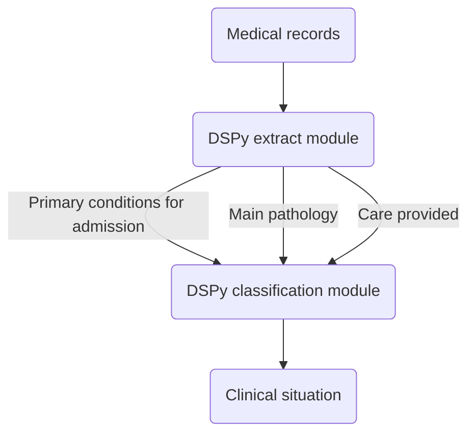

# Clinical situation
Detect clinical situation in medical records using DSPy

## How it works



## Set up

1. Install [Ollama](https://ollama.com/download) and follow instructions.
2. Create a `config.yaml` file in `clinical_situation/clinical_situation/config/` with your settings :

```yaml
llm:
  model: "ollama_chat/mistral"
  port: "http://localhost:11434"
```

## Run

:warning: CLI will come soon :warning:

```bash
python clinical_situation/__main__.py
```